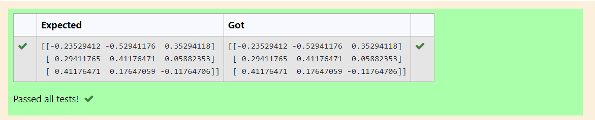

# INVERSE-OF-A-MATRIX
## Aim:
To write a python program to find the inverse of a matrix
## Equipment’s required:
1. 	Hardware – PCs
2. 	Anaconda – Python 3.7 Installation / Moodle-Code Runner
## Algorithm:
### Step1 : 
import numpy package
### Step 2: 
Get the input matrix
### Step 3: 
Using the np.linalg.inv(), we find the inverse of the given matrix
### Step 4: 
print the result

## Program:

```
#Program to find the inverse of a matrix.
#Developed by:  SUDHAKAR K
#RegisterNumber: 22007876

import numpy as n
a=n.array([[1,0,3],[-1,2,-2],[2,3,-1]])
r=n.linalg.inv(a)
print(r)
```

## Output:

## Result:
Thus the inverse of given matrix is successfully solved using python program

